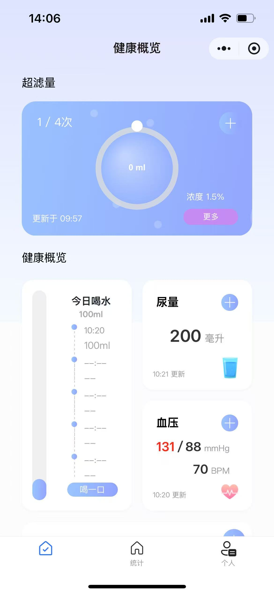
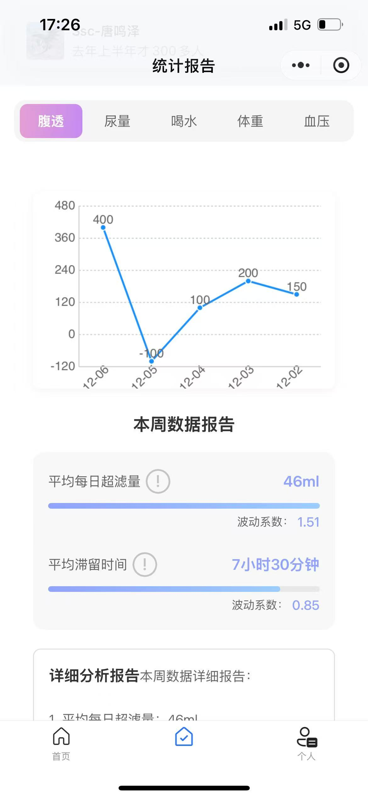

# 💧 Peritoneal Dialysis Health Management Mini Program

[🇨🇳 中文版说明](README_CN.md)

---

## 🧭 Overview

This project is designed to assist **peritoneal dialysis patients** in managing their daily health data and dialysis routines.  
It provides data recording, reminder settings, and trend visualization through a WeChat Mini Program interface.

> ⚠️ **Note:** The project is **still under active development** and not yet complete.

- **Frontend Repository:** [touxi-riji-web](https://github.com/greysonOuyang/touxi-riji-web) — built with **Taro + React + TypeScript + NutUI**
- **Backend Repository:** [futou-riji-backend](https://github.com/greysonOuyang/futou-riji-backend) — based on **Spring Boot**

---

## 🖼️ Screenshots

| Dashboard | Data Visualization |
|------------|--------------------|
|  |  |

---

## ⚙️ Core Features

| Module | Description |
|--------|--------------|
| **Dashboard** | Displays daily dialysis summary, key health indicators, and quick access buttons |
| **Health Records** | Record dialysis sessions, weight, blood pressure, heart rate, blood sugar, and more |
| **Reminders** | Set up notifications for dialysis, medication, and appointments |
| **Statistics & Trends** | View historical data and visualize key health trends |
| **Profile Center** | Manage user information, app settings, and preferences |

---

## 🧠 Technical Stack

| Layer | Technology | Description |
|-------|-------------|-------------|
| **Frontend** | Taro + React + TypeScript  | Build WeChat Mini Program UI |
| **Backend** | Spring Boot + MyBatis + MySQL | Provide data storage and health record management |

---

## 🔒 Security & Performance

- Sensitive health data is encrypted and securely transmitted
- Optimized local caching for smooth page transitions
- Backend stability enhanced via structured exception handling and validation

---

© 2025 Greyson Ouyang. All rights reserved.
